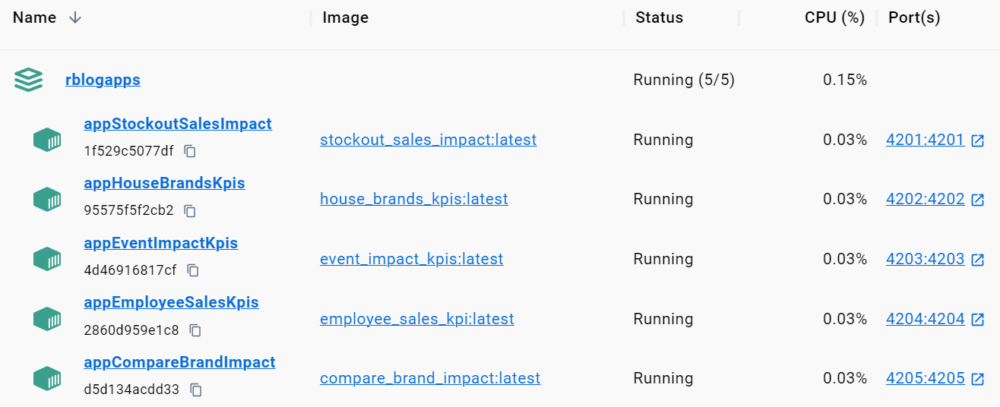

# rblogapps 

<!-- badges: start -->

[](https://github.com/r-data-science/rblogapps/actions/workflows/R-CMD-check.yaml)
[](https://github.com/r-data-science/rblogapps/actions/workflows/test-coverage.yaml)
[](https://codecov.io/gh/r-data-science/rblogapps)
[](https://github.com/r-data-science/rblogapps/actions/workflows/shiny-apps.yaml)

<!-- badges: end -->

------------------------------------------------------------------------

This repo contains an R package that includes all apps and app datasets
assiocated with my r data blog.

## Run App Containers

To run any of these apps as a docker container, simply the line
corresponding to each app:

```{bash}
docker run --name appStockoutSalesImpact \
  -p 4201:4201 --rm -dt bfatemi/stockout_sales_impact

docker run --name appHouseBrandsKpis \
  -p 4202:4202 --rm -dt bfatemi/house_brands_kpis

docker run --name appEventImpactKpis \
  -p 4203:4203 --rm -dt bfatemi/event_impact_kpis

docker run --name appEmployeeSalesKpis \
  -p 4204:4204 --rm -dt bfatemi/employee_sales_kpis

docker run --name appCompareBrandImpact \
  -p 4205:4205 --rm -dt bfatemi/compare_brand_impact
```

## Build App Images

To build images for each app, download this repo and from the top level
project directory, run the following:

```{bash}
docker-compose build
```

Once finished building, you will have an image for each of the package's
apps on your local machine. Next, to launch all run the following:

```{bash}
docker-compose up
```

The app containers will be launched and listening on ports 4201-4205:



Visit these links in your browser to interact with the apps:

-   [http://localhost:4201/ ](http://localhost:4201/)
-   [http://localhost:4202/](http://localhost:4201/)
-   [http://localhost:4203/](http://localhost:4201/)
-   [http://localhost:4204/](http://localhost:4201/)
-   [http://localhost:4205/](http://localhost:4201/)

## About R Package

The three main functions exported by this package are as follows:

`listBlogApps()`: Retrieves names of all apps included in this package

`runBlogApp(name)`: Run an app included in this package given it's name

`getBlogData(name)`: Returns an apps primary dataset given it's name

------------------------------------------------------------------------

## Examples in R

#### Install Package

```         
remotes::install_github("r-data-science/rblogapps")
```

#### List Package Apps and Datasets

```         
rblogapps::listBlogApps()
rblogapps::listBlogData()
```

#### Launch Package App

``` r
rblogapps::runBlogApp("employee_sales_kpis")
rblogapps::runBlogApp("house_brands_kpis")
rblogapps::runBlogApp("stockout_sales_impact")
rblogapps::runBlogApp("event_impact_kpis")
rblogapps::runBlogApp("compare_brand_impact")
```

#### See App Dataset

``` r
rblogapps::getBlogData("employee_sales_kpis")
rblogapps::getBlogData("house_brands_kpis")
rblogapps::getBlogData("stockout_sales_impact")
rblogapps::getBlogData("event_impact_kpis")
rblogapps::getBlogData("compare_brand_impact")
```

Proprietary - Do Not Distribute
